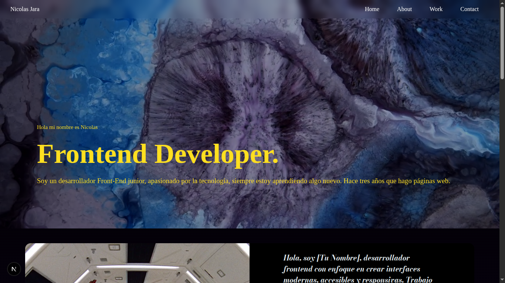

# 🧑‍💻 Mi Portafolio Web - Frontend Developer

Este es mi sitio personal como desarrollador frontend. Aquí muestro mis proyectos, habilidades técnicas, experiencia, y formas de contacto. Desarrollado con tecnologías modernas y responsive para todos los dispositivos.

## 🚀 Tecnologías utilizadas

- [Next.js 14](https://nextjs.org/)
- [TypeScript](https://www.typescriptlang.org/)
- [Tailwind CSS](https://tailwindcss.com/)
- [Framer Motion](https://www.framer.com/motion/) para animaciones
- [React Icons](https://react-icons.github.io/react-icons/)
- Deploy en [Vercel](https://vercel.com/)

## 🎯 Características

- Sitio responsive (mobile-first)
- Animaciones suaves con Framer Motion
- Dark/Light Mode
- Secciones: Sobre mí, Proyectos, Contacto, CV
- Integración con formulario de contacto funcional
- Accesible y con buenas prácticas de SEO

## 📸 Vista previa



## 🌐 Enlace al sitio

🔗 [https://tupagina.vercel.app](https://tupagina.vercel.app)

## 🛠️ Instalación local

```bash
git clone https://github.com/Nicolas-Eliazer-Jara/my-portafolio.git
cd portfolio
pnpm install
pnpm dev
