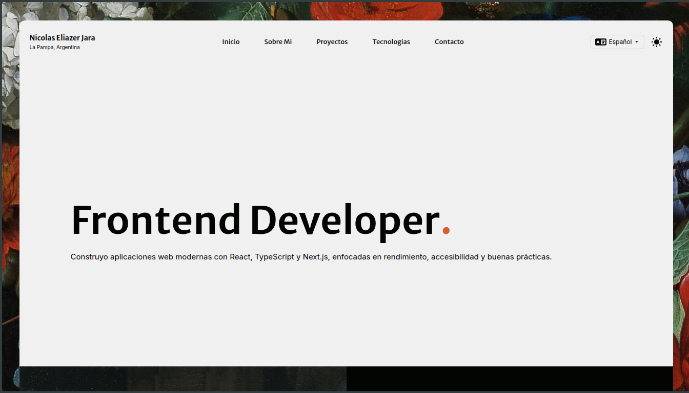

🌐 Portafolio Web - Nicolas Jara

Este es mi portafolio profesional como desarrollador frontend. Está diseñado para presentar mis mejores proyectos, tecnologías dominadas y habilidades principales.
100% responsive, moderno, funcional y optimizado.

✨ Características principales

Diseño moderno, elegante y totalmente responsive

Navegación fluida entre secciones

Modo oscuro (Dark Mode) con guardado automático de preferencia

Selector de idioma (Español / Inglés) mediante i18n.js

Animaciones e interacciones suaves con Framer Motion

Sonidos personalizados al interactuar con botones

Cursor personalizado

Navbar dinámica, con menú hamburguesa en móviles

Scroll individual por proyecto

Estructura limpia, modular y escalable

📸 Vista previa

⚙️ Tecnologías utilizadas

Next.js 15 (App Router + Client Components)

TypeScript

TailwindCSS

Framer Motion (animaciones suaves)

i18next + react-i18next (traducciones dinámicas)

React Hook Form + Zod (validación de formularios)

Zustand (gestión de estado en proyectos con carrito)

next/image (optimización de imágenes)

Custom Hooks + Tipado estricto

📁 Estructura del proyecto
├── app
├── components
│   ├── about.tsx
│   ├── footer.tsx
│   ├── home.tsx
│   ├── nav.tsx
│   ├── skills.tsx
│   └── works.tsx
├── data
│   ├── contact.tsx
│   ├── skillsData.tsx
│   └── works.tsx
├── fonts.ts
├── hook
│   ├── useAudio.ts
│   ├── useOutsideClick.ts
│   ├── useScroll.ts
│   └── usetheme.ts
├── i18n.js
├── layout.tsx
├── page.tsx
└── types
    └── work.d.ts

📱 Responsive

Diseño 100% adaptado para:

💻 Desktop

📱 Mobile

📱 Tablet

🚀 Cómo correr el proyecto localmente
git clone https://github.com/Nicolas-Eliazer-Jara/my-portafolio.git
cd my-portafolio
npm install
npm run dev

Luego abrí tu navegador en:
👉 http://localhost:3000

📄 Licencia

Este proyecto es de uso personal.
Si querés reutilizar alguna parte, por favor citá el repositorio o consultame antes.

✉️ Contacto

📧 nicolas.jara.dev@gmail.com

🌐 Sitio desplegado: https://nicolas-portafolio.vercel.app/
