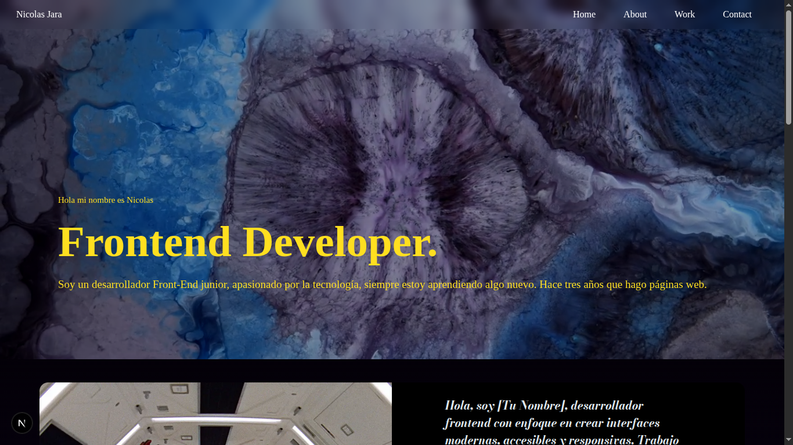

# 🌐 Portafolio Web - Nicolas Jara

Este es mi portafolio profesional como desarrollador frontend. Está diseñado para presentar mis mejores proyectos, tecnologías dominadas, y habilidades principales. 100% responsive, moderno, funcional y optimizado.


---

## ✨ Características principales

- Diseño moderno, elegante y responsive
- Navegación fluida entre secciones
- Proyectos destacados con imágenes interactivas
- Sistema de scroll individual por proyecto
- Cursor personalizado
- Animaciones y transiciones suaves
- Estructura limpia y escalable

---

## 📸 Vista previa



---

## ⚙️ Tecnologías utilizadas

- **Next.js 14** (App Router)
- **TypeScript**
- **TailwindCSS**
- **React Hook Form + Zod**
- **Zustand** (en proyectos con carrito)
- **Optimización de imágenes con `next/image`**
- **Custom Hooks + Tipado estricto**

---

## 📁 Estructura del proyecto

├── app/
│ ├── components/
│ ├── styles/
│ ├── pages/
│ ├── layout.tsx
│ ├── page.tsx
├── public/
│ └── img/work/
├── data/works.ts
├── types/
├── hooks/
├── README.md

---

## 📱 Responsive

Diseño 100% responsive optimizado para:

- 💻 Desktop
- 📱 Mobile
- 📱 Tablet

---

## 🚀 Cómo correr el proyecto localmente

```bash
git clone https://github.com/Nicolas-Eliazer-Jara/my-portafolio-
cd portfolio
npm install
npm run dev
Luego abrí tu navegador en:
👉 http://localhost:3000

---

📄 Licencia
Este proyecto es de uso personal. Si querés reutilizar alguna parte, por favor citá el repositorio o consultame antes.

---

✉️ Contacto
Si te interesa mi trabajo o querés contactarme:

📧 nicolas.jara.dev@gmail.com

🌐 Tu sitio desplegado en Vercel